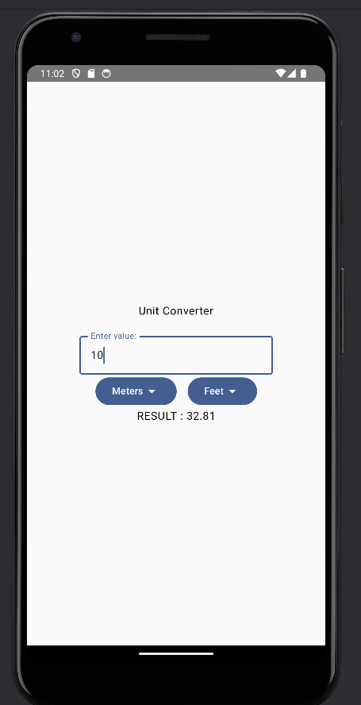
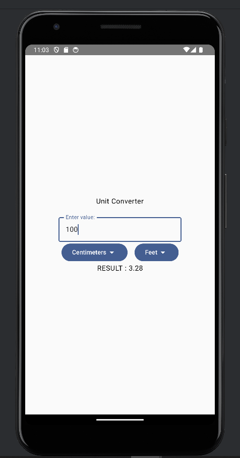
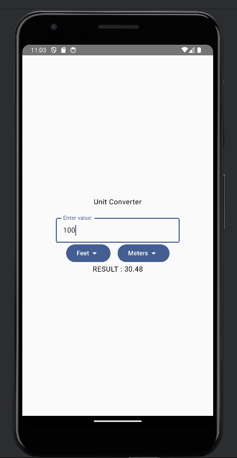
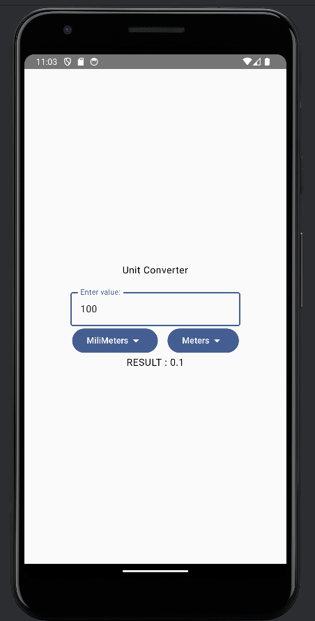

```markdown
# Unit Converter Jetpack Compose 🌟

A **Jetpack Compose** project showcasing a minimal Unit Converter app with two dropdowns, an input box, and a dynamic output display.

## 🖥️ Screenshots

Take a look at the app in action!

| Screen 1                     | Screen 2                     | Screen 3                     | Screen 4                     |
|------------------------------|------------------------------|------------------------------|------------------------------|
|  |  |  |  |

## 🚀 Getting Started

Follow these steps to run the project on your machine:

1. Clone this repository to your local machine:
   ```bash
   git clone https://github.com/Progambler227788/UnitConverterJetpackCompose.git
   ```
2. Open the project in **Android Studio**.
3. Build and run the app on your emulator or physical device.
```

### Key Notes:
1. The table and markdown syntax are formatted for proper rendering on GitHub.
2. Replace `https://github.com/Progambler227788/UnitConverterJetpackCompose.git` with the correct repository URL if different.
3. Ensure that the image files `outputSample1.png`, `outputSample2.png`, `outputSample3.png`, and `outputSample4.png` are in the same directory as the `README.md` file. GitHub fetches the images relative to the `README.md` file location.
